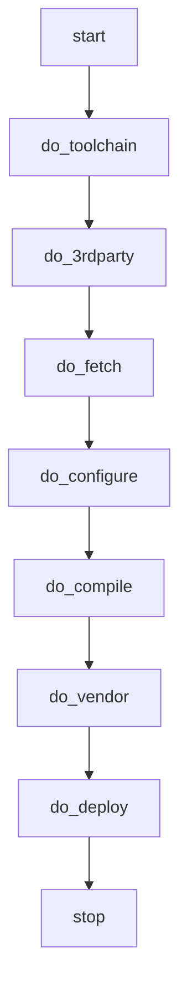

# 基于shell的Qt5编译工具 - build-qt5

build-qt5是一个用于嵌入式平台下Qt编译的shell工具，包含动态配置、下载、差分、三方库集成、项目集成、Qt裁剪、生成运行库、生成开发库、打包等功能

其设计上参考yocto的系统集成方式，也可以用于多平台的工程管理和编译

## 编译流程



## 配置方式

### 环境变量配置

- BUILD_DIR: 编译目录
- BUILD_SDK_DIR: sdk生成路径
- **BUILD_RUNTIME_DIR**: runtime生成路径
- SOURCE_DIR: 源码放置目录
- REPO_DIR: git仓库目录
- DOWNLOAD_DIR: 下载目录
- **TARGET_PACKAGE_DIR**: 打包路径
- **TARGET_SYSROOT**: 目标sysroot路径
- CMAKE_TOOLCHAIN_FILE: cmake的toolchain路径
- **NO_DEPLOY_PACKUP**: 不进行打包（0或1）

### platform配置方法

- 在platforms文件夹下创建[目标平台]文件夹
- qt5/build.list是Qt编译模块内容
- config文件是该平台具体的配置项，内有注释，这里不做阐述
- qt5/[Qt模块]/*的内容是对应该模块的patch（非必需）
- qt5/md5sum.txt是Qt的模块md5值查找表（非必需）
- qt5/[Qt模块]\.opt，是具体的模块裁剪参数（非必需）
- cmake/toolchain.cmake 是cmake的工具链配置（非必需）
- toolchain.sh是工具链的下载或者配置（非必需）
- 3rdparty.sh是三方库编译的配置（非必需）
- vendor.sh是集成库编译的配置（非必需）

## 编译方式

```shell
#查看可用平台
./build-qt5.sh
#清理
./build-qt5.sh [目标平台] clean
#编译
./build-qt5.sh [目标平台] all
#sdk和runtime及对应的压缩包默认在./build/[目标平台]的文件夹下
```

## 版权

Juntuan.Lu, 2020-2030, All rights reserved.
